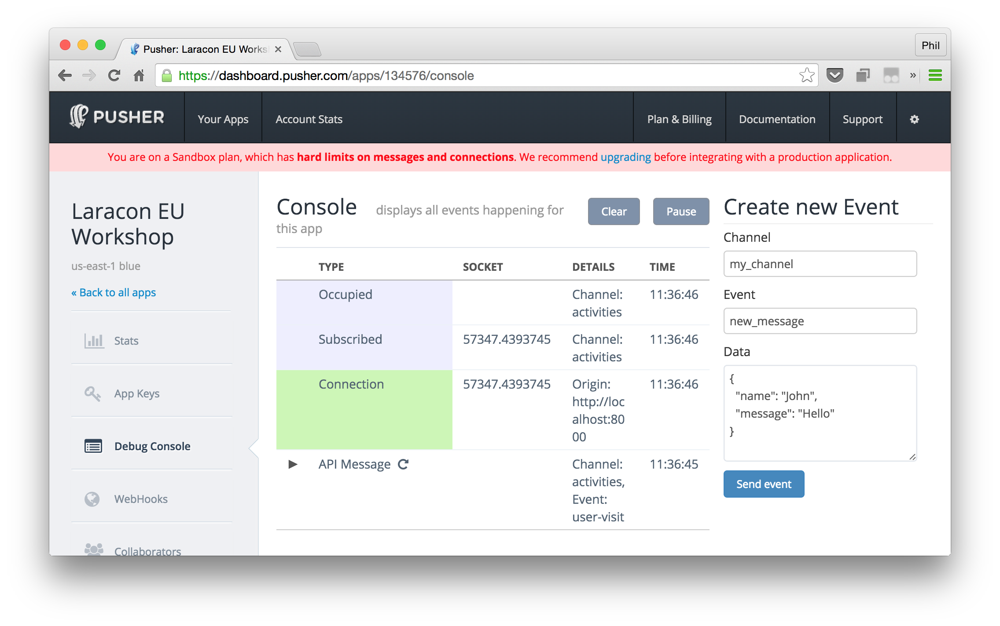
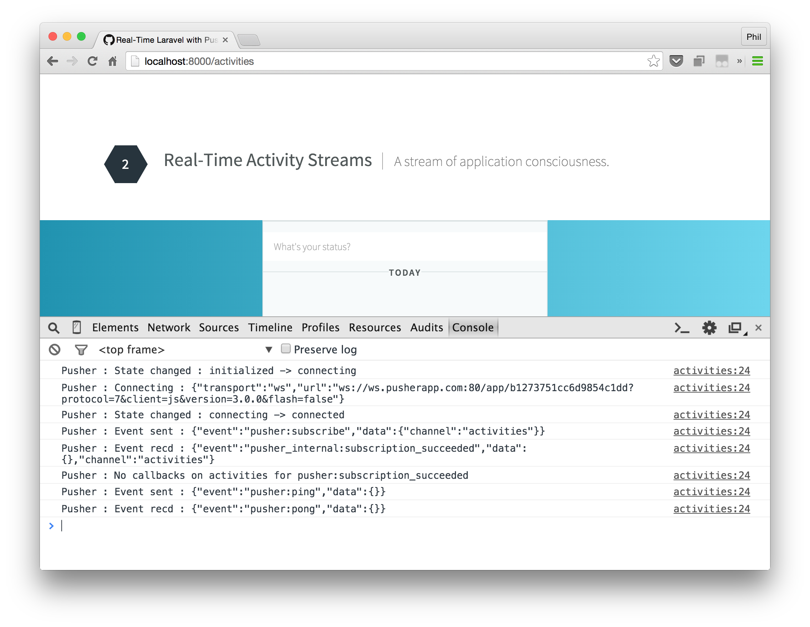

# Debugging your client-side integration with Pusher

The [Pusher Debug Console](https://pusher.com/docs/debugging#pusher_debug_console) is great for understand how the Pusher JavaScript library is interacting with Pusher.



Here's what to check:

* Are you seeing a `Connection` entry. If not, check you're using the correct Pusher Application Key.
* Are you seeing a `Subscribed` entry and is the `Channel` the one you expect to see?
* If the above seem fine then make sure the `Subscribed` entry is occuring *before* the `API Message` entry. If not, then it means the message is being sent before Pusher knows the client is interested in it.

As well as the Pusher Debug Console you can also configure the Pusher JavaScript library so that it will log information, exposing its internal workings, to the browser console. 



<i class="fa fa-rocket fa-2"></i> Update your client-side code:

```html
<script src="//js.pusher.com/3.0/pusher.min.js"></script>
<script>
Pusher.log = function(msg) {
  console.log(msg);
};

var pusher = new Pusher("{{env('PUSHER_KEY')}}")
...
```

<i class="fa fa-rocket fa-2"></i> From here we can check:

* Does the logging indicate that a connection is being established? `Pusher : State changed : connecting -> connected`
* Is the subscription to the channel succeeding? `Pusher : No callbacks on test-channel for pusher:subscription_succeeded`
* Is the event being received and does the event name match the one you're using in your call to `bind`? `Pusher : Event recd : {"event":"TestEvent","data":{"text":"Broadcasting in Laravel using Pusher!"},"channel":"test-channel"}`

## Where next?

Still stuck? **Ask the instructor** if you're in a workshop. If not, take a look at the [Pusher Support desk](https://support.pusher.com). From there you can contact support if required.

Let's see [what we've just learned](./learned.md).
